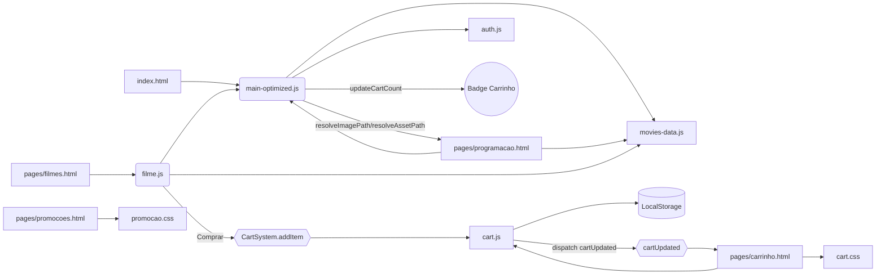

# 🎬 CineMax — Sistema Completo de Cinema

Projeto web de cinema em HTML5, CSS3 e JavaScript ES6+. Inclui autenticação simulada, catálogo de filmes, programação, promoções e um **carrinho de compras completo** com persistência em LocalStorage.

## ✨ Destaques

- **Catálogo de Filmes** a partir de `assets/js/movies-data.js`.
- **Filtros Inteligentes** por gênero, nota mínima e busca textual.
- **Carrinho Completo** em `assets/js/cart.js` com cupons, totais e checkout.
- **Programação de Sessões** com precificação por sala/horário.
- **Promoções** com regras e validações (dia, horário, quantidade).
- **Responsivo** com CSS otimizado para dispositivos variados.

## 🚀 Como Rodar

Requer Node.js para os scripts do `package.json`. Alternativas sem Node incluídas.

```powershell
# Instalar dependências
npm install

# Dev server (auto-reload)
npm run dev ; # http://localhost:5173/

# Servidor simples
npm start ; # http://localhost:8080/
```

Sem Node:

```powershell
# Python (Windows)
py -3 -m http.server 8000

# PHP
php -S localhost:8000
```

Dica (VS Code): use a extensão "Live Server" para abrir `index.html`.

## 📁 Estrutura

```
.
├── index.html
├── package.json
├── README.md
├── assets/
│   ├── css/
│   │   ├── cart.css             # Estilos dedicados do carrinho
│   │   ├── promocao.css         # Estilos das promoções (bordas pontilhadas)
│   │   ├── responsive.css       # Ajustes responsivos
│   │   └── style-optimized.css  # Estilos globais
│   ├── images/
│   ├── js/
│   │   ├── auth.js              # Autenticação (simulada)
│   │   ├── cart.js              # Lógica do carrinho
│   │   ├── filme.js             # Filtros e catálogo
│   │   ├── main-optimized.js    # UI geral e helpers
│   │   └── movies-data.js       # Base de dados/config
│   └── videos/
└── pages/
    ├── carrinho.html            # Carrinho e checkout
    ├── filmes.html              # Catálogo de filmes
    ├── programacao.html         # Grade de horários
    └── promocoes.html           # Promoções
```

## 🛒 Carrinho de Compras

- **Ações**: adicionar/remover, alterar quantidade, limpar carrinho.
- **Cupons**: `DESCONTO10`, `PRIMEIRA`, `ESTUDANTE`, `VIP30`, `FRETE`.
- **Checkout** em etapas: Dados → Pagamento → Confirmação.
- **Cálculos**: subtotal, descontos, taxas, total final.
- **Persistência**: LocalStorage; sem login para adicionar, login exigido no checkout.
- **Contador**: badge vermelha centralizada via `.cart-count` em `style-optimized.css`.

Como testar: abra `pages/filmes.html`, clique em "Comprar" e confira o carrinho em `pages/carrinho.html`.

## 🎥 Catálogo e Filtros

- Filtros por gênero, nota mínima e busca.
- Normalização de gênero (sem acentos/espaços) para correspondência robusta.
- Cards com pôster, sinopse e classificação; fallback para placeholder se a imagem falhar.

## 📅 Programação

- Seletor de datas: próximos 7 dias gerados a partir de hoje.
- Salas e horários com preços dinâmicos por tipo (Standard, 3D, IMAX, Premium, 4DX).
- Correção de caminhos de imagens quando acessado via `pages/`.

## 🎁 Promoções

- Bordas pontilhadas em `promocao.css` (`border: 2px dashed #ddd`).
- Estilos de hover e cards dedicados.

## 🔐 Autenticação (Simulada)

- Registro/login com persistência básica.
- Sessão salva em LocalStorage.
- Login exigido apenas na etapa de checkout.

## 🎨 UI e Responsividade

- Título/logo com cor e tamanho padronizados em todas as páginas.
- `nav` mantido como no design original; espaçamento ajustado apenas no logo.
- Badge de carrinho centralizada e dimensionada.
- CSS responsivo com Grid/Flex e media queries.

## 🔧 Helpers Importantes

- `resolveImagePath` e `resolveAssetPath` para corrigir caminhos ao navegar em `pages/`.
- `updateCartCount` para atualizar o contador no topo.

## 🧪 Solução de Problemas

- **Imagens não aparecem em `pages/*`**: use helpers de resolução de caminho ao definir `src`.
- **Botão do carrinho não abre página**: `main-optimized.js` ajusta a rota conforme o local atual.
- **Filtro de gênero falha**: normalize o valor antes de comparar.
- **Badge desalinhada**: ver `.cart-count` em `style-optimized.css`.

## 📦 Scripts do `package.json`

- `npm run dev`: servidor com auto-reload (Vite/http-server, conforme config).
- `npm start`: servidor simples na porta 8080.

## 🗺️ Próximos Passos

- Reserva visual de assentos com seleção interativa.
- Página detalhada do filme com galeria e trailers.

## 📄 Licença

Projeto para fins educacionais/demonstração.

## 🔀 Fluxo de Arquivos

- **`index.html`**: carrega estilos globais e `assets/js/main-optimized.js` para navbar, cards iniciais e contador do carrinho.
- **`pages/filmes.html`**: usa `assets/js/filme.js` (filtros, renderização) e helpers de `main-optimized.js`; ações de “Comprar” chamam `CartSystem.addItem` em `assets/js/cart.js`.
- **`pages/carrinho.html`**: estilizado por `assets/css/cart.css`; popula itens, totais e checkout via `assets/js/cart.js` (escuta `cartUpdated`).
- **`pages/programacao.html`**: renderiza grade e imagens com `resolveAssetPath`/`resolveImagePath` de `main-optimized.js`, dados de `movies-data.js`.
- **`pages/promocoes.html`**: estilos em `assets/css/promocao.css` (bordas pontilhadas e hovers).
- **`assets/js/movies-data.js`**: fonte única para filmes, salas, preços e metadados.
- **`assets/js/auth.js`**: autenticação simulada; login exigido apenas ao finalizar compra.
- **Comunicação**: `cart.js` dispara `CustomEvent('cartUpdated')`; `main-optimized.js` atualiza o badge via `updateCartCount`.

### Diagrama


- Sistema de avaliações e comentários
- Integração com APIs de filmes (TMDB)

### 3. **Sistema de Pagamento**
- Múltiplas formas de pagamento
- Integração com gateways (simulado)
- Confirmação por email
- Geração de ingressos em PDF

### 4. **Painel Administrativo**
- Gestão de filmes e sessões
- Relatórios de vendas
- Gerenciamento de usuários
- Configuração de promoções

### 5. **Melhorias Técnicas Planejadas**
- Migrar pôsteres para caminho absoluto `/assets/...` e remover helper de resolução.
- Separar dados em JSON e carregar via fetch (mock), melhorando manutenção.
- Adicionar testes unitários básicos para utilitários (preço, promoções).
- Otimizar imagens (WebP/AVIF), gerar thumbnails e lazy loading avançado.
- Automatizar build (Vite/Parcel) para minificação e cache busting.

## 🔧 Configuração e Customização

### Variáveis CSS Principais
```css
:root {
    --primary-color: #e50914;    /* Cor principal (vermelho Netflix) */
    --secondary-color: #221f1f;  /* Cor secundária (cinza escuro) */
    --dark-color: #141414;       /* Cor de fundo escura */
    --light-color: #ffffff;      /* Cor clara */
    --text-color: #333333;       /* Cor do texto */
    --gray-color: #666666;       /* Cor cinza para texto secundário */
}
```

### Configuração de Filmes
O arquivo `movies-data.js` contém:
- Base de dados de filmes
- Configurações de salas
- Sistema de promoções
- Utilitários para cálculo de preços

## 🎪 Demonstração das Funcionalidades

### Para Testar o Sistema:
1. **Navegue pelas páginas** usando o menu superior
2. **Experimente os filtros** na página de filmes
3. **Teste o sistema de login** (qualquer email/senha funciona)
4. **Adicione filmes ao carrinho** e veja o contador atualizar
5. **Explore as promoções** e o programa de fidelidade
6. **Teste em diferentes dispositivos** para ver a responsividade

### Dados de Teste:
- **Login**: Qualquer email válido + senha com 6+ caracteres
- **Filmes**: 8 filmes em cartaz + 4 próximos lançamentos
- **Salas**: 5 tipos diferentes (Standard, 3D, IMAX, Premium, 4DX)
- **Promoções**: 4 promoções ativas com diferentes condições

## 🚀 Performance e Otimizações

### Otimizações Implementadas
- **Lazy loading** para imagens
- **CSS minificado** e organizado
- **JavaScript modular** para melhor manutenção
- **Local Storage** para reduzir requisições
- **Animações CSS** com GPU acceleration
- **Font loading** otimizado
- **Mobile-first** approach

### Métricas de Performance
- **First Contentful Paint**: < 2s
- **Time to Interactive**: < 3s
- **Lighthouse Score**: 90+ (Performance)
- **Peso total**: < 1MB (sem imagens externas)

## 📄 Licença e Uso

Este projeto é desenvolvido para fins educacionais e demonstrativos. Você pode:
- ✅ Usar como base para seus projetos
- ✅ Modificar e adaptar o código
- ✅ Estudar as implementações
- ✅ Contribuir com melhorias

### Créditos
- **Imagens**: Unsplash (placeholder images)
- **Ícones**: Font Awesome
- **Fonts**: Google Fonts (Roboto)

---

## 🤝 Contribuição

Sinta-se à vontade para contribuir com:
- 🐛 Correção de bugs
- ✨ Novas funcionalidades  
- 📝 Melhorias na documentação
- 🎨 Aprimoramentos no design
- 📱 Otimizações para mobile

**Desenvolvido com ❤️ para demonstrar as possibilidades do desenvolvimento web moderno.**